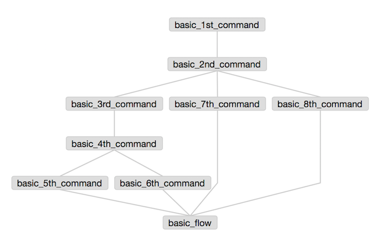
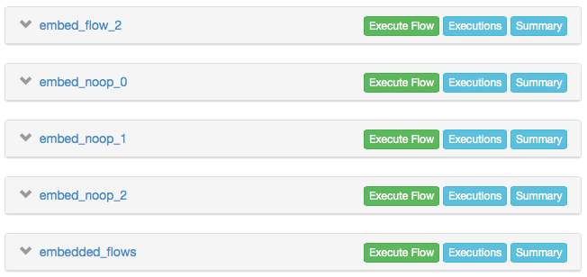
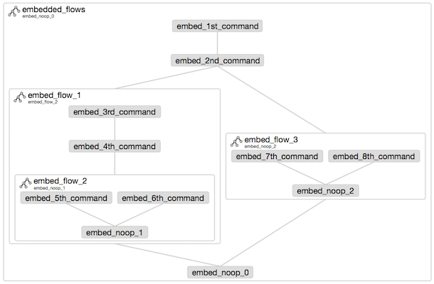
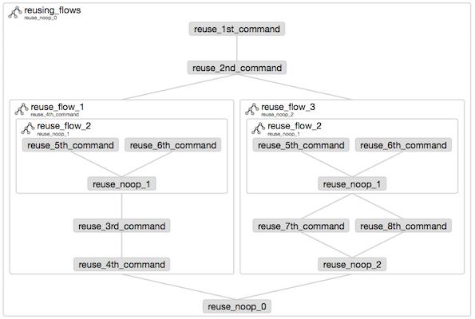

# Azkaban Examples
Examples to demonstrate flow structures and flow options in Azkaban.

There are very few _publicly visible_ examples of Azkaban workflows. Real workflows tend to be very business specific and contain sensitive information. Therefore getting started with Azkaban can require a lot of trial and error to determine how to generate "good" flows. Hopefully these examples will make things a bit clearer.

### Azkaban Job Types
The smallest unit of work in Azkaban is a `job`, a text file with a `.job` extension. Azkaban has a variety of job types and more can be added using the plugin system. [The job types are described in detail in the Azkaban docs.](http://azkaban.github.io/azkaban/docs/2.5/#job-types) These examples use just 3 types to keep things simple.

`command`
: Runs a supplied command in the native shell. All of the example jobs simply `echo` their name to the log.
```
    type=command
    command=echo "print this text to stdout"
    dependencies=run_this_job_first
```

`noop`
: "No Operation". Used to organise the flow, e.g. provide an 'endpoint' when a flow does not have a single final job.
```
    type=noop
    dependencies=run_this_job_first,run_this_job_too
```

`flow`
: Embeds a flow within the larger flow. These flows can be reused in the outer flow and also run on their own.
```
    type=flow
    flow.name=final_job_of_the_flow
    dependencies=run_this_job_first
```


## Projects
### Basic Flow
This is a very simple flow using direct depndencies and no subflows.



The jobs `3rd_command`, `7th_command` and `8th_command` depend directly on `2nd_command`. `basic_flow` is a `noop` job that **creates the entire flow** by depending direclty on the "final" jobs `5th_command`, `6th_command`, `7th_command` and `8th_command`. 

### Embedded Flows
This flow contains an explicitly named "outer" flow, embedded flows and subflows. The embedded flows are listed separately in project's the `Flows` tab and can each be run on their own. 



For each flow the large text value is the name of the job and the subtext value under it is the `flow.name` parameter from the job. Note that `flow.name` defines the *final* job in the flow. The flow structure is defined backwards from that job by the dependencies of each job. 



### Reusing Flows 
This flow builds on the embeded flows example by reusing the `flow_2` subflow multiple times. 

Note that reused flows cannot have any direct dependencies. This means, in practice, that reusing a subflow will often require embedding it as the first job within another subflow which declares any required dependencies. In this example `flow_2` takes no dependencies but `flow_1` and `flow_3` both depend on `2nd_command`




## Azkaban CLI / DSL
[A 3rd party Python "Azkaban CLI" is available on GitHub.](https://github.com/mtth/azkaban) It can be installed using `pip install azkaban`  (if you already have a Python and `pip` installed). [The full docs for the CLI are on Read the Docs.](http://azkabancli.readthedocs.org/en/latest/index.html)

The CLI might be better described as a ["domain specific language"](https://en.wikipedia.org/wiki/Domain-specific_language) (DSL) for Azkaban. It allows you to create Azkaban projects and workflows in a very compact format and to use Python code to manipulate the workflows.


If you have a basic familiarity with Python (or a similar language) you may find the CLI to be much more productive than manually creating and uploading workflows that consist of hundreds of jobs. The following example commands look for the default jobs file `jobs.py` and assumes you have defined a default Azkaban server in the `~/.azkabanrc` settings file.

Create the project ( `-c` flag) and upload to Azkaban:
```
azkaban build -c
 > Project azkaban_examples successfully built and uploaded (id: 1, size: 6.8kB, upload: 1).
 > Details at https://yourazkabanserver.com:8443/manager?project=azkaban_examples
```

Run the "reusing_flows" workflow immediately:
```
azkaban run -k reusing_flows
 > Flow reusing_flows successfully submitted (execution id: 999).
 > Details at https://yourazkabanserver.com:8443:8443/executor?execid=999
```

<!-- Schedule the "reusing_flows" workflow to run daily at midnight and kill the worfklow on first failure and send alerts to `joe@example.com`:
```
azkaban schedule -k -e joe@example.com -s 1d -t 00:00:00.000 reusing_flows
 > Project azkaban_examples successfully built and uploaded (id: 7, size: 6.8kB, upload: 1).
 > Details at https://yourazkabanserver.com:8443/manager?project=azkaban_examples
``` -->

