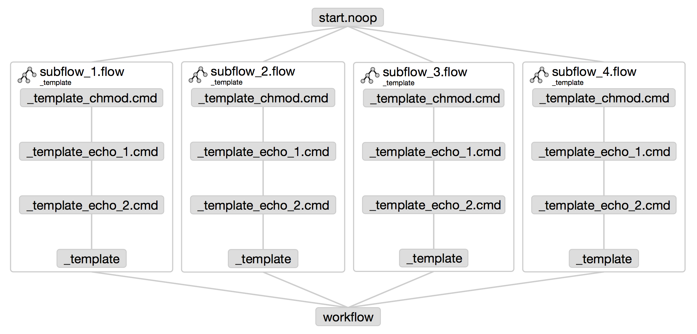

# Azkaban Examples
Examples to demonstrate flow structures and flow options in Azkaban.

There are very few _publicly visible_ examples of Azkaban workflows. Real workflows tend to be very business specific and contain sensitive information. Therefore getting started with Azkaban can require a lot of trial and error to determine how to generate "good" flows. Hopefully these examples will make things a bit clearer.

### Azkaban Job Types
The smallest unit of work in Azkaban is a `job`, a text file with a `.job` extension. Azkaban has a variety of job types and more can be added using the plugin system. [The job types are described in detail in the Azkaban docs.](http://azkaban.github.io/azkaban/docs/2.5/#job-types) These examples use just 3 types to keep things simple.

`command`
: Runs a supplied command in the native shell. All of the example jobs simply `echo` their name to the log.
```
    type=command
    command=echo "print this text to stdout"
    dependencies=run_this_job_first
```

`noop`
: "No Operation". Used to organise the flow, e.g. provide an 'endpoint' when a flow does not have a single final job.
```
    type=noop
    dependencies=run_this_job_first,run_this_job_too
```

`flow`
: Embeds a flow within the larger flow. These flows can be reused in the outer flow and also run on their own.
```
    type=flow
    flow.name=final_job_of_the_flow
    dependencies=run_this_job_first
```

## Projects
### Basic Flow
This flow uses direct depndencies and no subflows. It demonstrates the way Azkaban creates the flow sequence by **working backwards** from a job that *no other jobs depend on*. 


The "final" job `basic_flow` is a `noop` job that nothing depends on. It **creates the entire flow** by depending directly on jobs `step_5.cmd`, `step_6.cmd`, `step_7.cmd` and `step_8.cmd`. The jobs `step_3.cmd`, `step_7.cmd` and `step_8.cmd` depend on `step_2.cmd`. Finally `step_2.cmd`  depends on `step_1.cmd` which "starts" the flow because it depends on nothing else.

### Template Flows
Azkaban allows flows to be embedded in other flows and to be embedded multiple times. This feature is very useful for removing duplication from your projects by using "template" workflows.

Often you need to run the same logic many times with differing inputs. For instance: download > process > re-upload a file, update > delete > insert a table, etc. Templates keep the process logic in a single place. You embed the template as a subflow in your workflows and pass in custom properties that specify the work to be done.



Define a template job:
* Properties are passed into the command using the `${variable}` format
* I like to prefix templates with an `_` (underscore) to clarify their purpose.
     * This is necessary because template workflows are visible in the web front end.
```
    # _template.job
    type=command
    command=echo "Variable 1: ${custom_1} | Variable 2: ${custom_2}"
```

Embed the template:
* The `flow.name` key defines what is embedded. 
* Custom properties are passed to the template by defining them as additional keys. 
```
    # workflow.job
    type=flow
    flow.name=_template
    custom_1=val1
    custom_2=val2
```


## Azkaban CLI / DSL
[A 3rd party Python "Azkaban CLI" is available on GitHub.](https://github.com/mtth/azkaban) It can be installed using `pip install azkaban`  (if you already have a Python and `pip` installed). [The full docs for the CLI are on Read the Docs.](http://azkabancli.readthedocs.org/en/latest/index.html)

The CLI might be better described as a ["domain specific language"](https://en.wikipedia.org/wiki/Domain-specific_language) (DSL) for Azkaban. It allows you to create Azkaban projects and workflows in a very compact format and to use Python code to manipulate the workflows.

### Creating and Uploading a Project
If you have a basic familiarity with Python (or a similar language) you may find the CLI to be much more productive than manually creating and uploading workflows that consist of hundreds of jobs. The following example commands look for the default jobs file `jobs.py` and assumes you have defined a default Azkaban server in the `~/.azkabanrc` settings file.


Create the project ( `-c` flag) and upload to Azkaban:
```
    azkaban build -c
     > Project azkaban_examples successfully built and uploaded (id: 1, size: 6.8kB, upload: 1).
     > Details at https://yourazkabanserver.com:8443/manager?project=azkaban_examples
```

### Running a Project from the CLI
Run the "reusing_flows" workflow immediately:
```
    azkaban run -k reusing_flows
     > Flow reusing_flows successfully submitted (execution id: 999).
     > Details at https://yourazkabanserver.com:8443:8443/executor?execid=999
```


<!-- Schedule the "reusing_flows" workflow to run daily at midnight and kill the worfklow on first failure and send alerts to `joe@example.com`:
```
    azkaban schedule -k -e joe@example.com -s 1d -t 00:00:00.000 reusing_flows
     > Project azkaban_examples successfully built and uploaded (id: 7, size: 6.8kB, upload: 1).
     > Details at https://yourazkabanserver.com:8443/manager?project=azkaban_examples
``` -->

